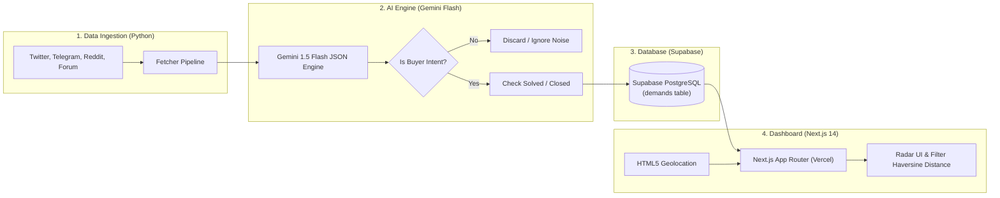

# Demand Intelligence & Opportunity Lead Bot 🛰️

> Platform otomatis untuk deteksi dan pemantauan peluang bisnis (*Lead Generation & Demand Radar*) yang memantau kebutuhan barang, jasa, vendor, dan impor (*WTB*, *"butuh supplier"*, *"cari jasa"*) dari berbagai kanal publik (Twitter/X, Telegram, Reddit, Forum).

Sistem memproses data menggunakan **Google Gemini 1.5 Flash AI** untuk ekstraksi intent pembeli, kategori, koordinat geolokasi, serta status terselesaikan (*fulfilled/solved*), menyimpannya ke **Supabase (PostgreSQL)**, dan menampilkannya pada dashboard interaktif **Next.js 14+ (App Router)** yang siap dideploy ke **Vercel**.

---

## 🏗️ Arsitektur Sistem



---

## 📁 Struktur Direktori

```text
├── .env.example              # Template variabel lingkungan sistem
├── supabase_schema.sql       # Skema database PostgreSQL Supabase + RLS & Haversine Function
├── vercel.json               # Konfigurasi zero-config deployment untuk Vercel
├── package.json              # Root package untuk menjalankan scripts lintas direktori
│
├── crawler/                  # Python Bot Scraper & AI Ingestion Engine
│   ├── config.py             # Konfigurasi env, kata kunci, & referensi koordinat kota Indonesia
│   ├── gemini_extractor.py   # Ekstraktor schema JSON dengan Google Gemini 1.5 Flash
│   ├── pipeline.py           # Pipeline utama: Fetch -> Gemini Filter -> Supabase Upsert
│   ├── requirements.txt      # Dependensi Python (google-generativeai, supabase, pydantic, dll.)
│   ├── test_crawler.py       # Unit test untuk intent classifier, solved status, & koordinat
│   └── fetchers/             # Modul multi-source fetcher
│       ├── base.py           # Base abstract class & RawDemandItem dataclass
│       ├── mock_fetcher.py   # Mock dataset realistis (buyer demand, solved, & spam)
│       ├── reddit_rss_fetcher.py # Scraper open-endpoint Reddit (r/indonesia, r/finansial)
│       └── search_fetcher.py # Scraper web search / SerpAPI
│
└── frontend/                 # Next.js 14+ Dashboard (App Router, Tailwind CSS, Lucide Icons)
    ├── src/
    │   ├── app/
    │   │   ├── layout.tsx    # Root layout dengan font Inter & tema dark radar
    │   │   ├── page.tsx      # Dashboard utama (Filter, State, Geolocation)
    │   │   ├── globals.css   # Styling Tailwind & animasi pulse radar
    │   │   └── api/demands/  # API Route Next.js untuk integrasi data & query Haversine
    │   ├── components/
    │   │   ├── DemandCard.tsx        # Kartu permintaan (Status pill, Source badge, Link Asli)
    │   │   ├── StatsHeader.tsx       # Hitungan peluang aktif hari ini & metrik kategori
    │   │   ├── FilterBar.tsx         # Pencarian teks, filter status, kategori, & scope lokasi
    │   │   ├── GeolocationBanner.tsx # Banner mode 'Near Me' dengan radius slider
    │   │   ├── DemandDetailModal.tsx # Modal inspeksi detail konten mentah & analisis AI
    │   │   ├── Header.tsx            # Header aplikasi & indikator status sumber data
    │   │   └── EmptyState.tsx        # Tampilan jika filter tidak menemukan hasil
    │   ├── lib/
    │   │   ├── haversine.ts  # Rumus matematika jarak koordinat Haversine (KM)
    │   │   ├── supabase.ts   # Inisialisasi client Supabase
    │   │   ├── mockData.ts   # Seed dataset awal untuk preview instan
    │   │   └── utils.ts      # Helper tanggal relatif & styling badge
    │   └── types/
    │       └── demand.ts     # Definisi tipe TypeScript
    ├── tailwind.config.ts
    ├── tsconfig.json
    └── package.json
```

---

## ⚡ Langkah Instalasi & Penggunaan

### 1. Setup Database Supabase
1. Buat project gratis di [Supabase](https://supabase.com).
2. Masuk ke **SQL Editor** pada dashboard Supabase Anda.
3. Buka file [`supabase_schema.sql`](supabase_schema.sql), salin seluruh isinya, dan klik **Run**.
   - Ini akan membuat tabel `demands`, index pencarian, policy RLS, fungsi Haversine `get_demands_near`, dan 8 data awal realistis.

### 2. Konfigurasi Variabel Lingkungan
Salin `.env.example` menjadi `.env` di root dan `frontend/.env.local`:
```bash
cp .env.example .env
cp .env.example frontend/.env.local
```
Isi nilai berikut:
```env
NEXT_PUBLIC_SUPABASE_URL=https://xxxxxxxxxxxx.supabase.co
NEXT_PUBLIC_SUPABASE_ANON_KEY=eyJhbGciOi...
SUPABASE_SERVICE_ROLE_KEY=eyJhbGciOi...
GEMINI_API_KEY=AIzaSy...
```

---

### 3. Menjalankan Python Crawler

```bash
# Pindah ke direktori crawler
cd crawler

# Pasang dependensi
pip install -r requirements.txt

# Jalankan pipeline scraper & AI classification
python pipeline.py --source mock

# Atau jalankan scraper feed live Reddit
python pipeline.py --source reddit

# Jalankan pengujian unit test
python -m unittest test_crawler.py
```

Output pipeline akan memfilter postingan yang tidak memiliki niat beli (iklan jualan/loker), menandai status `is_solved = true` jika ada indikasi `"sudah dapet"`, dan melakukan *upsert* ke Supabase berdasarkan `source_url`.

---

### 4. Menjalankan Next.js Dashboard

```bash
# Dari root proyek:
npm run dev

# Atau masuk ke frontend/:
cd frontend
npm run dev
```
Buka browser di `http://localhost:3000`.

---

## 🎯 Fitur Dashboard Utama

1. **StatsHeader**:
   - Menghitung jumlah **Peluang Aktif Hari Ini** dengan indikator radar berdenyut (*pulse*).
   - Metrik total lead terpantau, transaksi terselesaikan, dan distribusi kategori.
2. **Filter Lokasi & Haversine Near Me**:
   - **Dekat Saya (Near Me)**: Menggunakan HTML5 Geolocation API dan menghitung jarak radius kilometer dengan formula Haversine.
   - Pilihan radius interaktif: 25 km, 50 km, 100 km, 250 km, hingga 500 km.
   - Pilihan cakupan **Seluruh Indonesia** atau **Internasional / Global**.
3. **Filter Status & Kategori**:
   - Filter Status: *Semua*, *Aktif Saja (Open)*, atau *Terpenuhi (Closed)*.
   - Filter Kategori: *Barang*, *Jasa*, *Impor*, *Supplier*.
4. **DemandCard**:
   - Menampilkan judul, ringkasan AI, pill status (Hijau = Open, Abu-abu = Closed).
   - Badge platform asal (Twitter/X, Telegram, Reddit, Facebook, Forum).
   - Waktu relatif (*misal: "2 jam yang lalu"*).
   - Tombol **"Buka Link Asli"** menuju tautan publik postingan.
   - Tombol **"Lihat Analisis AI"** untuk memeriksa teks mentah dan parameter ekstraksi Gemini.

---

## 🚀 Deployment ke Vercel

Proyek ini telah dikonfigurasi dengan file `vercel.json` dan root `package.json`:
1. Push repository ke GitHub / GitLab.
2. Import repository di [Vercel](https://vercel.com).
3. Masukkan Environment Variables di Vercel:
   - `NEXT_PUBLIC_SUPABASE_URL`
   - `NEXT_PUBLIC_SUPABASE_ANON_KEY`
4. Klik **Deploy**!
